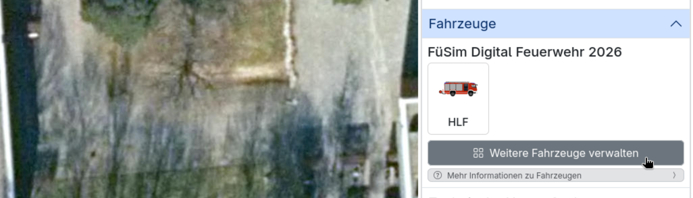

# Übungselemente

Mit Übungselementen sind all jene Objekte gemeint, die im Laufe einer Übung durch die Teilnehmenden direkt oder indirekt verwaltet oder betrachtet werden. Ein Großteil ist auf der Übungskarte zu sehen.

> [!TIP]
> Einige Übungselemente werden außerhalb der Übung in Sammlungen verwaltet.
> Sammlungen können zentral erstellt, bearbeitet, gelöscht und geteilt sowie in Übungen eingebunden werden.
> Siehe [Übungselemente verwalten](./../4_editing/2_elements.md).
> 

## Ansichten

Bei Ansichten handelt es sich um Bereiche einer Übung, die mit einem weißen Rechteck markiert sind.

### Interaktion auf der Übungskarte

Sie können über den Editor platziert werden.

Wenn auf den Rand oder die Beschriftung einer Ansicht geklickt wird, können Übungsleitende eine Ansicht mit gedrückter Maustaste verschieben. Wird eine Ecke angeklickt, kann analog die Größe der Ansicht geändert werden. Dieselben Modifikationen sind auch mit Touch-Gesten möglich.

### Einstellungsmöglichkeiten

Im Einstellungs-Popup kann einer Ansicht ein Name zugewiesen werden.

### Nutzung in Übungen

Bei Übungen werden Ansichten üblicherweise genutzt, um Abschnitte darzustellen, in denen ein Teilnehmender als Führungskraft die Verantwortung übernehmen soll.

Bei der [Verwaltung der Übungsteilnehmenden](4_conduction.md#teilnehmende-verwalten) kann den Teilnehmenden jeweils eine Ansicht zugewiesen werden, über deren Grenzen sie dann während der Übung nicht hinaus scrollen oder zoomen können. Auch in den [Statistiken](6_evaluation.md#statistiken) lassen sich die Patienten-, Fahrzeug- und Personalzahlen nach Ansicht filtern.

> [!TIP]
> Für Übungsleitende wird die Karte standardmäßig auf die platzierten Ansichten zentriert. Wenn Übungselemente außerhalb der von Teilnehmenden bespielten Ansichten platziert werden, kann es sich für Übungsleitende daher lohnen, zusätzliche Ansichten um diese Elemente oder um die relevante Übungsfläche als ganzes zu ziehen.

> [!TIP]
> Wenn eine Übung einen größeren Einsatz mit einer mehrstufigen Hierarchie abgebildet wird, sollten auch für die Zwischenebenen Ansichten angelegt werden, um z. B. die Patienten und anwesenden Einsatzkräfte auf allen Ebenen statistisch auszuwerten.

## Transferpunkte

Transferpunkte sind ovale Punkte auf der Karte, die mit einem blauen Rahmen und einem blauen Mittelstreifen gekennzeichnet sind. Sie markieren für Übungsteilnehmende die Eintreff- und Abfahrtspunkte von [Einsatzkräften](#fahrzeuge-mit-personal-und-material).

### Interaktion auf der Übungskarte

Transferpunkte können im Editor platziert und anschließend von Übungsleitenden per Drag-and-Drop flexibel auf der Karte verschoben werden.

In der Übungsleitungsansicht werden standardmäßig Verbindungslinien zwischen verbundenen Transferpunkten angezeigt (siehe Einstellungsmöglichkeiten). Diese sind für Teilnehmende nicht sichtbar. Sie können im Editor aktiviert oder deaktiviert werden.

Teilnehmende interagieren mit Transferpunkten, indem sie einzelne [Fahrzeuge oder Personal](#fahrzeuge-mit-personal-und-material) auf die Punkte ziehen und anschließend aus einer Auswahlliste das designierte Transferziel auswählen.

### Einstellungsmöglichkeiten

Im Einstellungs-Popup kann im Tab <kbd>Namen</kbd> für jeden Transferpunkt ein interner und ein externer Name festgelegt werden. Der interne Name wird auf der Karte angezeigt und darf daher nur 16 Zeichen lang sein. Der externe Name wird bei anderen Transferpunkten angezeigt, wenn Einsatzkräfte dorthin geschickt werden. Im Tab <kbd>Transferpunkte</kbd> des Einstellungs-Popups kann angegeben werden, zu welchen anderen Transferpunkten eine Verbindung besteht und wie viele Minuten der Transfer dauert. Die Zeitangabe wirkt in beide Richtungen. Im Tab <kbd>Krankenhäuser</kbd> können verbundene Krankenhäuser ausgewählt werden.

> [!TIP]
> Der interne Name sollte so gewählt werden, dass es der Funktion für Übungsteilnehmende entspricht. z. B. „Neue Kräfte“ (wenn dort alarmiertes Personal ankommt), „von/nach Süden“ (wenn darüber Transferpunkte in der entsprechenden Richtung angebunden sind) oder „Krankenhäuser“ (wenn darüber Krankenhäuser angebunden sind).
> Der externe Name sollte dem Standort des Transferpunktes entsprechen, also z. B. dem Namen der Ansicht, in der sich der Transferpunkt befinden (z. B. „Abschnitt Nord“).

### Nutzung in Übungen

Transferpunkte können als Eintreffpunkte für Kräfte dienen, die über die [Leitstelle](4_conduction.md#alarmierungen) alarmiert wurden. Wenn Transferpunkte untereinander verbunden sind, können über sie Kräfte zwischen verschiedenen Orten in der Übung verschoben werden, was eine gewisse Zeit in Anspruch nimmt (siehe [Transferübersicht](4_conduction.md#transfers-verwalten)). Dazu müssen Teilnehmende oder Übungsleitende ein Fahrzeug oder Personal auf den Ausgangs-Transferpunkt verschieben; es taucht dann entsprechend verzögert am anderen Transferpunkt wieder auf. Zuletzt können Fahrzeuge von Transferpunkten zu einem verbundenen Krankenhaus geschickt werden.

## Zonen

Bei Zonen handelt es sich um Bereiche auf der Übungskarte, die benannt, farblich markiert sowie auf eine bestimmte Anzahl und bestimmte Arten von Fahrzeugen beschränkt sein können.

Eine Zone wird aus einer Vorlage im Editor heraus erstellt, wobei neben einer _Eingeschränkten Zone_ ohne besondere Eigenschaften bereits Vorlagen für _Ladezone_, _Pufferzone_ und _RTH-Landeplatz_ bereitstehen.

### Interaktion auf der Übungskarte

Analog zu den Ansichten kann mit einem anhaltenden Klick (oder einer Berührung auf einem Touch-Gerät) auf die Fläche, den Rand oder die Beschriftung eine Zone verschoben werden. Wird die Ecke angeklickt oder berührt, kann die Größe geändert werden.

### Einstellungsmöglichkeiten

Im Einstellungs-Popup der Zone kann im Tab <kbd>Einstellungen</kbd> der Name, die Kapazität und die Farbe der Zone eingestellt werden. Bei der Kapazität handelt es sich um die Anzahl der Fahrzeuge, die sich in der Zone aufhalten. Für den Namen und die Kapazität der Zone kann zudem jeweils eingestellt werden, ob sie für Teilnehmende sichtbar sind. Im Tab <kbd>Fahrzeugbeschränkungen</kbd> kann für jede Fahrzeugvorlage eingestellt werden, ob Fahrzeuge dieser Art unbeschränkt erlaubt sind (grün), unter die Kapazitätsgrenze fallen (gelb) oder pauschal verboten sind (rot).

### Nutzung in Übungen

Sofern es entsprechend eingestellt ist, wird zu einer Zone den Teilnehmenden die aktuelle Anzahl und Kapazität der enthaltenen Fahrzeuge angezeigt. Das kann den Teilnehmenden helfen, den Überblick zu behalten.

Zusätzlich wird die Kapazitätsbeschränkung durchgehend überprüft. Wenn Fahrzeuge, die verboten oder über der erlaubten Kapazität sind, in einen Bereich verschoben werden sollen, schlägt das fehl und das Fahrzeug wird an den Ausgangspunkt zurückgeschoben.

> [!WARNING]
> Die Beschränkungen der Zone gelten nur für das Verschieben von Fahrzeugen auf der Karte. Das heißt, wenn sich ein Transferpunkt auf einer Zone befindet und ein Fahrzeug an dem Transferpunkt ankommt, welches eigentlich nicht erlaubt ist oder die Kapazität überschreitet, erscheint es trotzdem in der Zone.

## Fahrzeuge (mit Personal und Material)

Fahrzeuge sind die wichtigste taktische Einheit, die in der FüSim Digital von den Teilnehmenden verwaltet wird. Fahrzeuge beinhalten Personal und Materialien. Fahrzeuge können auf der Karte platziert, aber vor allem auch über [Alarmgruppen](#alarmgruppen) in den Einsatz geschickt werden.

### Interaktion auf der Übungskarte

Übungsleitende können Fahrzeuge direkt aus dem Editor heraus auf der Karte platzieren.

Fahrzeuge und ausgestiegenes Personal können von Teilnehmenden und Übungsleitenden flexibel auf der gesamten Karte per Drag-and-Drop hin- und hergeschoben werden.

Mit einem Klick auf das Fahrzeug öffnet sich ein Popup, in dem das Personal und die Patienten im Fahrzeug aufgelistet werden. Teilnehmende haben einen Button <kbd>Alle aussteigen</kbd>, mit dem Personal, Material und Patienten das Fahrzeug verlassen. Für Übungsleitende gibt es einen zusätzlichen Button <kbd>Alle einsteigen</kbd>, um das Personal und Material mit einem Klick wieder "an Bord" zu holen.

Das ausgestiegene Personal und Material können auf der Karte gleichermaßen per Drag-and-Drop bewegt werden. Wenn es in der Nähe von [Patienten](#patienten) platziert wird, erscheint eine Verbindungslinie, um die Behandlungszuordnung darzustellen. Mit einem Klick auf das Personal oder Material sehen Teilnehmende zudem in einem Pop-up die möglichen Behandlungskapazitäten.

> [!WARNING]
> Es gibt keine automatischen Kontrollmechanismen für die Bewegung von Fahrzeugen, Personal und Material in der Übung. Das heißt, sofern keine [Zone](#zonen) eingerichtet wurde, können sie auch auf Bereiche der Karte bewegt werden, die in der realen Welt unerreichbar wären (z. B. auf Hausdächer). Gleichermaßen können Fahrzeuge zudem auch dann bewegt werden, wenn kein Personal als Kraftfahrer an Bord ist.

### Einstellungsmöglichkeiten in der Übung

- <kbd>Fahrzeugnahme</kbd>: Individueller Name, welcher unter dem Fahrzeug auf der Karte sowie in Auswertungsansichten angezeigt wird.

> [!TIP]
> Weitere Einstellungsmöglichkeiten für Fahrzeugvorlagen, sowie deren Personal und Material, sind in Sammlungen verfügbar.
> Siehe [Übungselemente verwalten](./../4_editing/2_elements.md).

### Nutzung in Übungen

Fahrzeuge sind die wichtigste taktische Einheit in der FüSim Digital.

Fahrzeuge, die manuell auf der Karte platziert sind, stellen Kräfte dar, die bei Übungsbeginn (entspricht der Übernahme der Führung durch die Teilnehmenden) bereits vor Ort sind. Dabei handelt es sich typischerweise um ersteintreffende Einsatzmittel, die verstreut und noch ohne zentrale Taktik arbeiten.

Da FüSim Digital Übungen meistens die Frühphase eines Einsatzes umfassen, wo das Nachalarmieren von Einsatzkräften ein wichtiges Lernziel ist, werden die meisten Fahrzeuge in [Alarmgruppen](#alarmgruppen) hinterlegt und über diese durch die Leitstelle in den Einsatz geschickt.

## Patienten

Die Behandlung von Patienten ist die zentrale Herausforderung in einer MANV-Lage. Entsprechend sind Patienten, die sich dynamisch verändern, ein Kernelement der FüSim Digital.

### Interaktion auf der Übungskarte

Übungsleitende können Patienten aus dem Editor heraus auf der Karte platzieren. Sowohl Übungsleitende als auch Teilnehmende können Patienten per Drag-and-Drop auf der Karte verschieben.

Das Patientensymbol auf der Karte zeigt, ob ein Patient gehfähig ist (stehendes Icon) oder nicht (liegendes Icon). Zusätzlich zeigt ein Punkt in der Mitte die aktuelle Sichtungsfarbe an. Wenn [Personal und Material](#fahrzeuge-mit-personal-und-material) neben einen Patienten geschoben werden, erscheinen Verbindungslinien, die anzeigen, welches medizinische Personal welchen Patienten aktuell behandelt. Wurde dem Patienten ein Ticket zugewiesen, wird dies über ein Ticket-Symbol über dem Patienten dargestellt.

Teilnehmende sehen, wenn sie Patienten anklicken, ein Pop-up mit der Patienten-ID und dem Sichtungsstatus in der Überschrift sowie vier Tabs für den Inhalt. Im Tab <kbd>Allgemein</kbd> sind die Stammdaten (ID, Name, Alter, Geschlecht, Anschrift, Biometrie) sowie ein Feld für Anmerkungen zu finden, das durch die Teilnehmenden ausgefüllt werden kann. Im Tab <kbd>Vorsichtung</kbd> sind medizinische Informationen sowie ein Auswahlmenü zu finden, in dem eine Sichtungskategorie ausgewählt und Patienten als Transportpriorität markiert werden können. Im Tab <kbd>QR-Code</kbd> ist ein QR-Code zu sehen, der standardmäßig die Patienten-ID repräsentiert. Der als QR-Code angezeigte Text kann manuell überschrieben werden. Im Tab <kbd>Erkundung</kbd> können Übungsleitende zusätzliche Informationen hinterlegen, die Teilnehmende dann während der Übung aufrufen können. Die Patienten erhalten dann ein zusätzliches Sprechblasen-Symbol, welches das Vorhandensein von Erkundungsinformationen kennzeichnet. Siehe [Erkundungselemente](#erkundungselemente) für Details.

Übungsleitende sehen ein identisches Popup, wobei im Tab <kbd>Allgemein</kbd> zusätzlich als <kbd>Beschreibung</kbd> der zu erwartende medizinische Verlauf mit einigen Icons angezeigt wird (quasi die Musterlösung, siehe folgender Abschnitt).

### Einstellungsmöglichkeiten

> [!IMPORTANT]
> Patienten können in der FüSim Digital derzeit nicht bearbeitet werden.

Die Patienten sind in der FüSim nach medizinischem Verlauf sortiert, wobei der Verlauf immer durch eine Folge von drei Icons gekennzeichnet wird:

- <svg xmlns="http://www.w3.org/2000/svg" width="16" height="16" fill="currentColor" class="bi bi-arrow-right-square-fill" viewBox="0 0 16 16" style="color: rgb(220, 53, 69);"><path d="M0 14a2 2 0 0 0 2 2h12a2 2 0 0 0 2-2V2a2 2 0 0 0-2-2H2a2 2 0 0 0-2 2zm4.5-6.5h5.793L8.146 5.354a.5.5 0 1 1 .708-.708l3 3a.5.5 0 0 1 0 .708l-3 3a.5.5 0 0 1-.708-.708L10.293 8.5H4.5a.5.5 0 0 1 0-1"/></svg>/<svg xmlns="http://www.w3.org/2000/svg" width="16" height="16" fill="currentColor" class="bi bi-arrow-right-square-fill" viewBox="0 0 16 16" style="color: rgb(255, 193, 7);"><path d="M0 14a2 2 0 0 0 2 2h12a2 2 0 0 0 2-2V2a2 2 0 0 0-2-2H2a2 2 0 0 0-2 2zm4.5-6.5h5.793L8.146 5.354a.5.5 0 1 1 .708-.708l3 3a.5.5 0 0 1 0 .708l-3 3a.5.5 0 0 1-.708-.708L10.293 8.5H4.5a.5.5 0 0 1 0-1"/></svg>/<svg xmlns="http://www.w3.org/2000/svg" width="16" height="16" fill="currentColor" class="bi bi-arrow-right-square-fill" viewBox="0 0 16 16" style="color: rgb(25, 135, 84);"><path d="M0 14a2 2 0 0 0 2 2h12a2 2 0 0 0 2-2V2a2 2 0 0 0-2-2H2a2 2 0 0 0-2 2zm4.5-6.5h5.793L8.146 5.354a.5.5 0 1 1 .708-.708l3 3a.5.5 0 0 1 0 .708l-3 3a.5.5 0 0 1-.708-.708L10.293 8.5H4.5a.5.5 0 0 1 0-1"/></svg> = stabil
- <svg xmlns="http://www.w3.org/2000/svg" width="16" height="16" fill="currentColor" class="bi bi-exclamation-triangle-fill" viewBox="0 0 16 16" style="color: rgb(220, 53, 69);"><path d="M8.982 1.566a1.13 1.13 0 0 0-1.96 0L.165 13.233c-.457.778.091 1.767.98 1.767h13.713c.889 0 1.438-.99.98-1.767zM8 5c.535 0 .954.462.9.995l-.35 3.507a.552.552 0 0 1-1.1 0L7.1 5.995A.905.905 0 0 1 8 5m.002 6a1 1 0 1 1 0 2 1 1 0 0 1 0-2"/></svg>/<svg xmlns="http://www.w3.org/2000/svg" width="16" height="16" fill="currentColor" class="bi bi-exclamation-triangle-fill" viewBox="0 0 16 16" style="color: rgb(255, 193, 7);"><path d="M8.982 1.566a1.13 1.13 0 0 0-1.96 0L.165 13.233c-.457.778.091 1.767.98 1.767h13.713c.889 0 1.438-.99.98-1.767zM8 5c.535 0 .954.462.9.995l-.35 3.507a.552.552 0 0 1-1.1 0L7.1 5.995A.905.905 0 0 1 8 5m.002 6a1 1 0 1 1 0 2 1 1 0 0 1 0-2"/></svg>/<svg xmlns="http://www.w3.org/2000/svg" width="16" height="16" fill="currentColor" class="bi bi-exclamation-triangle-fill" viewBox="0 0 16 16" style="color: rgb(25, 135, 84);"><path d="M8.982 1.566a1.13 1.13 0 0 0-1.96 0L.165 13.233c-.457.778.091 1.767.98 1.767h13.713c.889 0 1.438-.99.98-1.767zM8 5c.535 0 .954.462.9.995l-.35 3.507a.552.552 0 0 1-1.1 0L7.1 5.995A.905.905 0 0 1 8 5m.002 6a1 1 0 1 1 0 2 1 1 0 0 1 0-2"/></svg> = Komplikation
- <svg xmlns="http://www.w3.org/2000/svg" width="16" height="16" fill="currentColor" class="bi bi-heartbreak-fill" viewBox="0 0 16 16" style="color: rgb(220, 53, 69);"><path d="M8.931.586 7 3l1.5 4-2 3L8 15C22.534 5.396 13.757-2.21 8.931.586M7.358.77 5.5 3 7 7l-1.5 3 1.815 4.537C-6.533 4.96 2.685-2.467 7.358.77"/></svg>/<svg xmlns="http://www.w3.org/2000/svg" width="16" height="16" fill="currentColor" class="bi bi-heartbreak-fill" viewBox="0 0 16 16" style="color: rgb(255, 193, 7);"><path d="M8.931.586 7 3l1.5 4-2 3L8 15C22.534 5.396 13.757-2.21 8.931.586M7.358.77 5.5 3 7 7l-1.5 3 1.815 4.537C-6.533 4.96 2.685-2.467 7.358.77"/></svg> = lebensrettende Maßnahme erforderlich
- <svg xmlns="http://www.w3.org/2000/svg" width="16" height="16" fill="currentColor" class="bi bi-signpost-fill" viewBox="0 0 16 16" style="color: rgb(220, 53, 69);"><path d="M7.293.707A1 1 0 0 0 7 1.414V4H2a1 1 0 0 0-1 1v4a1 1 0 0 0 1 1h5v6h2v-6h3.532a1 1 0 0 0 .768-.36l1.933-2.32a.5.5 0 0 0 0-.64L13.3 4.36a1 1 0 0 0-.768-.36H9V1.414A1 1 0 0 0 7.293.707"/></svg> = Transportpriorität
- <svg xmlns="http://www.w3.org/2000/svg" width="16" height="16" fill="currentColor" class="bi bi-x-circle-fill" viewBox="0 0 16 16" style="color: rgb(33, 37, 41);"><path d="M16 8A8 8 0 1 1 0 8a8 8 0 0 1 16 0M5.354 4.646a.5.5 0 1 0-.708.708L7.293 8l-2.647 2.646a.5.5 0 0 0 .708.708L8 8.707l2.646 2.647a.5.5 0 0 0 .708-.708L8.707 8l2.647-2.646a.5.5 0 0 0-.708-.708L8 7.293z"/></svg> = verstorben

Im Editor sind die Patienten nach der initialen Sichtungskategorie sortiert; darunter sind Vorlagen nach ihrem medizinischen Verlauf aufgelistet. Eine Zahl bei jeder Vorlage zeigt, wie viele Ausprägungen für diesen medizinischen Verlauf hinterlegt sind, wobei die Ausprägungen sich durch verschiedene Texte zu den medizinischen Details (im Tab <kbd>Vorsichtung</kbd>) unterscheiden. Beim Platzieren auf der Karte wird eine der Ausprägungen des gewählten Verlaufs zufällig ausgewählt. Gleichermaßen werden alle Stammdaten zufällig generiert.

### Nutzung in Übungen

Patienten sollten von Übungsleitenden bei der Erstellung und vor dem Übungsstart in die Übung platziert werden.

Patienten können während der laufenden Übung auch von Teilnehmenden verschoben werden. Analog zu einem realen Einsatz kann dadurch z. B. das schnelle „Sammeln“ der gehfähigen Patienten am Rand der Einsatzstelle geübt werden. Auch liegende Patienten können frei bewegt werden, was z. B. dem Aufbau einer strukturierten Patientenablage oder dem Vorbereiten auf den Abtransport entsprechen könnte. Je nach Lernziel müssen die Übungsleitenden darauf achten, dass liegende Patienten im Sinne des Übungsrealismus nicht zu frühzeitig verschoben werden, damit die Teilnehmenden eine realistischere Herausforderung bei der Raumordnung haben.

Die medizinischen Details und das manuelle Auswählen einer Sichtungsfarbe durch Teilnehmende im Tab <kbd>Vorsichtung</kbd> ermöglichen, dass Teilnehmende die Besatzung eines ersteintreffenden Rettungsmittels spielen und entsprechend die Vorsicht übernehmen müssen. Sobald weitere Kräfte eintreffen, sollten die Teilnehmenden allerdings die Rolle einer Führungskraft einnehmen und die unterstellten Einsatzkräfte vorsichten lassen. Dazu muss, wie bei der medizinischen Behandlung, das entsprechende Personal neben die Patienten geschoben werden, bis eine Verbindungslinie erscheint. Pro Patient wird eine Minute zur Vorsichtung benötigt.

Ebenso kann im Tab <kbd>Vorsichtung</kbd> jedem Patienten ein Ticket zugewiesen werden. Diese Zuweisung dient ausschließlich dazu, Patienten mit Ticket auf der Karte optisch unterscheiden zu können, wie wenn ein Ticket auf eine physische Patientenanhängekarte geklebt wurde. Darüber hinaus hat die Zuweisung eines Tickets keine Funktion, insbesondere können Patienten unabhängig davon, ob ein, und wenn ja, welches Ticket zugewiesen wurde, in jedes erreichbare Krankenhaus transportiert werden. Die Art der Ticket-Zuweisung kann in den [Übungseinstellungen](1_general.html#patienten) festgelegt werden.

## Technische Herausforderungen

> [!WARNING]
> Das Erstellen von eigenen technischen Herausforderungen ist derzeit noch in Entwicklung.
> Es gibt im Moment nur eine geringe Menge an Vorlagen und die Bearbeitung ist nur eingeschränkt möglich.

Neben Patienten kann es viele weitere Herausforderungen in einem Einsatz geben.
Technische Herausforderungen sind in der FüSim Digital der Überbegriff für Kartenelemente, wo von Personal konkrete Aufgaben erfüllt werden müssen.

Technische Herausforderungen bestehen aus einer oder mehreren _Teilherausforderungen_.
Einzelne Teilherausforderungen können verschiedene Zustände mit eigenen Erkundungsinformationen haben.
Die erste Teilherausforderung legt zusätzlich fest, welche Grafik auf der Karte angezeigt werden soll.

### Interaktion auf der Übungskarte

Analog zu den Ansichten kann mit einem anhaltenden Klick (oder einer Berührung auf einem Touch-Gerät) auf die Fläche oder
den Rand eine technische Herausforderung verschoben werden.
Wird die Ecke angeklickt oder berührt, kann die Größe geändert werden.

Mit einem Klick auf die technische Herausforderung öffnet sich für Übungsleitende eine Übersichtsansicht.
Hierbei gibt es einen Tab für jede Teilherausforderung, wo jeweils

- der aktuelle Zustand,
- der Fortschritt aller Timer und Aufgaben,
- der Fortschritt aktuell möglicher Übergänge,
- und aktuell zugewiesenes Personal mit deren Aufgaben

sichtbar sind.

Teilnehmende können Personal per Drag-and-Drop auf die technischen Herausforderungen ziehen und bekommen dann mögliche Aufgaben angezeigt.

Teilnehmende sehen, wenn sie eine technische Herausforderung anklicken, ein Pop-up mit den dynamischen Erkundungstexten aller Teilherausforderungen.
Für jede Teilherausforderung wird ein einzelner Tab mit dem jeweiligen aktuellen Erkundungstext angezeigt.
Siehe [Erkundungselemente](#erkundungselemente) für Details.

### Einstellungsmöglichkeiten

Übungsleitende können bei bestehende Vorlagen im Editor und bei bereits platzierten Herausforderungen auf der Karte
die einzelnen Teilherausforderungen bearbeiten.
Für eine Teilherausforderung ist Folgendes einstellbar:

- der Name der Teilherausforderung
- der Erkundungstext eines jeden Zustands
- die Zeitdauer jedes Timers
- die benötigte Zeit jeder Aufgabe

## Bilder

Bei den Bildern handelt es sich um frei platzierbare, dekorative Übungselemente.

### Interaktion auf der Übungskarte

Teilnehmende sehen Bilder auf der Übungskarte, können aber nicht mit ihnen interagieren.

Übungsleitende können Bilder aus dem Editor heraus platzieren und per Drag-and-Drop auf der Karte verschieben.

Alle anderen Übungselemente werden über den Bildern angezeigt.

### Einstellungsmöglichkeiten

Nach dem Platzieren können im Einstellungsfenster die <kbd>Bildadresse</kbd> sowie die <kbd>Höhe</kbd> geändert werden. Zusätzlich kann Folgendes für platzierte Bilder eingestellt werden:

- <kbd>**Position sperren**</kbd>: Wenn diese Option aktiviert ist, können Übungsleiter das Bild nicht mehr versehentlich verschieben. Das ist nützlich, z.B. wenn Bilder als Hintergrund für die Übungsfläche genutzt werden.
- <kbd>**Reihenfolge**</kbd>: Legt fest, in welcher Ebene sich überlappende Bilder angezeigt werden. Ein Bild mit einer höheren Zahl überdeckt ggf. eines mit einer niedrigeren. Die Buttons <kbd>Vordergrund</kbd> und <kbd>Hintergrund</kbd> geben einem Bild automatisch eine Ebene, die größer oder kleiner als die aller anderen Bilder ist.

Zudem lassen sich im Tab <kbd>Erkundung</kbd> zusätzliche Informationen hinterlegen, die Teilnehmende dann während der Übung aufrufen können. Die Bilder erhalten dann ein zusätzliches Lupen-Symbol, welches das Vorhandensein von Erkundungsinformationen kennzeichnet. Siehe [Erkundungselemente](#erkundungselemente) für Details.

> [!TIP]
> Weitere Einstellungsmöglichkeiten für Kartenbilder sind in Sammlungen verfügbar.
> Siehe [Übungselemente verwalten](./../4_editing/2_elements.md).

### Nutzung in Übungen

Bilder sind hauptsächlich als dekoratives Element vorgesehen. Beispielsweise können Fahrzeugsilhouetten Verkehr und beengte Arbeitsmöglichkeiten auf Straßen darstellen und Bilder von Feuer oder Trümmerteilen entsprechende Einsatzursachen visuell andeuten.

Es ist auch möglich, ein großes Bild als Hintergrund für eine Übung zu verwenden, z. B. wenn ein Einsatz im Innenraum geübt wird.

## Erkundungselemente

Bei Erkundungselementen handelt es sich einerseits um [Patienten](#patienten) und [Bildern](#bilder), bei denen zusätzliche Erkundungsinformationen hinzugefügt wurden, und andererseits um dedizierte, in einer Übung einzeln platzierbare Elemente:

- **Passantin/Passant**: Strichmännchen mit Sprechblase
- **Erkundung**: Lupe

### Nutzung in Übungen

Die Erkundungselemente können aus dem Bereich <kbd>Erkundung</kbd> im Editor auf die Karte gezogen und dort positioniert werden. Teilnehmende können die Erkundungsinformationen dann per Klick auf eine Sprechblase/Lupe ansehen.

### Einstellungsmöglichkeiten

Ein Übungsleiter kann durch einen Klick auf das Erkundungselement dort Informationen hinterlegen. Dabei kann ein <kbd>Interner Name</kbd> vergeben werden, welcher später z. B. in der Auswertung zur Wiedererkennung dient. Über <kbd>Inhalte sind für Teilnehmende sichtbar</kbd> lässt sich die Sichtbarkeit für Teilnehmende ein- und ausschalten. Im Rich-Text-Editor können dann die Informationen hinterlegt werden.

## Krankenhäuser

Krankenhäuser können in der FüSim Digital als mögliche Transportziele für den Abtransport von [Patienten](#patienten) hinterlegt werden.

### Einstellungsmöglichkeiten

Krankenhäuser werden im Fenster <kbd>Krankenhäuser</kbd> erstellt, das von Übungsleitenden im [Hauptmenü in der unteren Menüleiste](2_user_interfaces.md#konfigurations--und-übersichtsfenster-nur-in-übungsleitenden-ansicht) in der Kategorie <kbd>Erstellung</kbd> aufgerufen werden kann.

In dem Fenster können in einer Liste Krankenhäuser mit Namen und einer Transportzeit angelegt werden. Alle Namen und Zeiten können nachträglich angepasst werden; neu erstellte Krankenhäuser können wieder gelöscht werden.

> [!IMPORTANT]
> Da für bestimmte Aspekte der [simulierten Bereiche](../3_simulation/) mindestens ein Krankenhaus erforderlich ist, kann das erste Krankenhaus in der Liste nicht gelöscht werden.

### Nutzung in Übungen

Wenn es für das Übungsziel dienlich ist, kann eine große Anzahl von Krankenhäusern angelegt werden. Im [Statistik](6_evaluation.md#statistiken)-Fenster wird dann die Transferzeit genutzt, um die Ankunftszeiten im jeweiligen Krankenhaus auszuwerten.

In einer Übung können Krankenhäuser als Ziel bei einem [Transferpunkt](#transferpunkte) hinterlegt werden.

> [!TIP]
> Zu einem Krankenhaus geschickte Fahrzeuge sind permanent aus der Übung entfernt. Es wird daher empfohlen, nicht denselben Transferpunkt für Transfers an der Einsatzstelle und zu Krankenhäusern zu nutzen.

Übende können einen Patiententransport in ein Krankenhaus auslösen, indem sie ein Fahrzeug mit einem eingeladenen Patienten per Drag-and-Drop auf einen entsprechend verknüpften Transferpunkt ziehen und anschließend den Transport beauftragen.

> [!WARNING]
> Auch Fahrzeuge _ohne_ Patient können ins Krankenhaus geschickt werden und sind dann nicht mehr verfügbar. Es sollte darauf geachtet werden, das das nicht ausversehen passiert.

## Alarmgruppen

Über Alarmgruppen werden in Übungen [Einsatzmittel (Fahrzeuge)](#fahrzeuge-mit-personal-und-material) in strukturiertem Rahmen dem Einsatzort zugeführt.

### Einstellungsmöglichkeiten

Alarmgruppen werden im Fenster <kbd>Alarmgruppen</kbd> erstellt, das von Übungsleitenden im [Hauptmenü in der unteren Menüleiste](2_user_interfaces.md#konfigurations--und-übersichtsfenster-nur-in-übungsleitenden-ansicht) in der Kategorie <kbd>Erstellung</kbd> aufgerufen werden kann.

In dem Fenster können neue Alarmgruppen hinzugefügt sowie wieder gelöscht werden. Jeder Gruppe kann ein individueller Name zugewiesen werden (standardmäßig „???“). Mit einem Klick auf das entsprechende Häkchen kann zudem ein Limit für die maximale Anzahl an Auslösungen festgelegt werden, wodurch sich versehentliche Doppelarmierungen vermeiden lassen.

Jede Alarmgruppe kann mit Fahrzeugen gefüllt werden; für jedes Fahrzeug können ein individueller Name sowie eine Eintreffzeit (in Minuten) festgelegt werden. Fahrzeuge können mit einem Klick wieder aus der Gruppe entfernt werden.

> [!TIP]
> Alarmgruppen können auch als Vorlagen in Sammlungen gespeichert werden, um sie in anderen Übungen wiederzuverwenden.
> Siehe [Übungselemente verwalten](./../4_editing/2_elements.md).

### Nutzung in Übungen

Alarmgruppen entsprechen mehr oder weniger spezifisch einer Alarm- und Ausrückeordnung, die die Teilnehmenden nachalarmieren sollten. Es ist auch möglich, das gestaffelte Eintreffen der initial alarmierten Kräfte über eine Alarmgruppe abbilden, die die Übungsleitenden bereits bei der Vorbereitung auslösen, sodass sich die Fahrzeuge beim Übungsstart im Transfer befinden.

Typische Alarmgruppen für generische MANV-Übungen sind beispielsweise MANV-10, MANV-20, MANV-30 etc., wobei bei jeder Erhöhung der MANV-Stufe alle weiteren Alarmgruppen bis zur aktuell gemeldeten Patientenzahl ausgelöst werden.

Alternativ ist es möglich, mit Alarmgruppen sehr konkret die Stichwörter der örtlichen Alarm- und Ausrückeordnung nachzubilden. Dabei ist zu beachten, dass, je kleinteiliger die Stichwörter sind, desto stärker die Eintreffzeiten an den jeweiligen Einsatzort angepasst werden müssen. Eine Wiederverwendung an einem anderen Ort im selben Leitstellengebiet ist somit ohne Mehraufwand nicht möglich.

In beiden hier beschriebenen Anwendungen sollten die Alarmgruppen auf eine Auslösung begrenzt werden. Das gilt insbesondere für die [von Teilnehmenden verwaltete Leitstelle](2_user_interfaces.md#leitstellenansicht-für-teilnehmende). Wenn die örtliche Alarm- und Ausrückeordnung mehrfach alarmierbare Module umfasst, sollten jeweils mehrere Alarmgruppen für „xxx (erster Alarm)“, „xxx (zweiter Alarm)“ etc. angelegt werden, um den zunehmend langen Anfahrtswegen Rechnung zu tragen.

Alarmgruppen ohne Auslösungsbeschränkung oder mit einer hohen Anzahl möglicher Auslösungen sind beispielsweise für Szenarien sinnvoll, in denen mit Alarmgruppen das Nachfordern von Kräften aus einem voll besetzten Bereitstellungsraum abgebildet wird.

## Maßnahmen

Über Maßnahmen können [Übungsteilnehmende](2_user_interfaces.md#teilnehmenden-ansicht) verschiedene Interaktionen mit der Übung vornehmen. Maßnahmen sollen all jene Tätigkeiten der (in einer Ansicht) übenden Führungskraft simulieren, die über das (bei der FüSim Digital im Vordergrund stehende) Disponieren von Kräften auf der Übungskarte hinausgehen. Daher können Maßnahmen teilweise auch echte Zeit in Anspruch nehmen.

Maßnahmen sind in der FüSim Digital als generisches Baukastensystem angelegt: Übungsleitende stellen jede Maßnahme aus einzelnen _Schritten_ zusammen und legen so selbst fest, unter welchen Begriffen die Teilnehmenden welches Verhalten auslösen können. So lassen sich sehr unterschiedliche Übungszenarien mit jeweils individuell gestalteten Interaktionsmöglichkeiten umsetzen.

Das erlaubt insbesondere auch, dass Übungsleitende mehr Maßnahmen anlegen, als für ein Szenario tatsächlich nötig oder sinnvoll sind. Durch ein solches Überangebot lässt sich verhindern, dass die vorhandenen Maßnahmen als "Checkliste" dienen und somit als Hilfestellung bei der Übungsbearbeitung fungieren.

Die so konfigurierten Maßnahmen stehen den Teilnehmenden während der Übungsdurchführung in der Kartenansicht zur Verfügung.

### Interaktion auf der Übungskarte

Maßnahmen werden ausschließlich von Übungsteilnehmenden in der [Teilnehmenden-Ansicht](2_user_interfaces.md#teilnehmenden-ansicht) ausgelöst. Die Maßnahmenleiste erscheint am unteren Rand der Karte, sobald die Übung läuft und mindestens eine Maßnahme angelegt ist. Übungsleitende haben diese Leiste nicht und können Maßnahmen daher nicht selbst ausführen.

Die Leiste zeigt zunächst nur die Kategorien, in die die Maßnahmen eingeteilt sind. Da jede Maßnahme in einer Kategorie sein muss, wird hier, sofern Maßnahmen vorhanden sind, mindestens ein Eintrag angezeigt. Wenn keine Maßnahmen angelegt sind, werden weder Kategorien noch die Leiste angezeigt.

Ein Klick auf eine Kategorie klappt darüber eine Liste der enthaltenen Maßnahmen auf; ein erneuter Klick oder ein Klick an eine beliebige andere Stelle auf der Karte schließt sie wieder. Enthält eine Kategorie mehr Maßnahmen, als in die Breite passen, kann die Liste seitlich gescrollt werden.

Mit einem Klick auf eine Maßnahme wird diese gestartet. Die Schritte der Maßnahme werden dann nacheinander abgearbeitet: Manche öffnen ein Fenster, andere warten auf eine Eingabe auf der Karte, wieder andere laufen ohne Zutun der Teilnehmenden ab. Während eine Maßnahme läuft, wird die Maßnahmenleiste ausgeblendet und stattdessen ein Hinweisfeld mit dem Namen der laufenden Maßnahme und dem Hinweistext des aktuellen Schrittes angezeigt.

> [!IMPORTANT]
> Wird eine Maßnahme abgebrochen – etwa über <kbd>Abbrechen</kbd>, die <kbd>Esc</kbd>-Taste oder das Schließen eines Fensters –, wird die _gesamte_ Maßnahme verworfen. Bereits gezeichnete Zeichnungen werden wieder entfernt, es werden keine Einsatztagebucheinträge angelegt und keine Alarmierungen ausgelöst. Es gibt keine teilweise ausgeführte Maßnahme.

### Nutzung in Übungen

Maßnahmen sind kein festes Repertoire, sondern ein Baukasten: Jede Übungsleitung stellt sich aus den verfügbaren Schritt-Typen die Maßnahmen zusammen, die zum jeweiligen Szenario und Lernziel passen. Beispiele für mögliche Maßnahmen sind:

- **Stichworterhöhung** – eine [Verzögerung](#verzögerung) von 30 Sekunden, gefolgt von einer [Alarmierung](#alarmierung). Die Teilnehmenden fordern eigenständig Kräfte nach, müssen aber – wie im echten Einsatz – kurz auf die Rückmeldung der Leitstelle warten. Diese Maßnahmenkonfiguration ist das Grundmuster für alle Maßnahmen, bei denen die Teilnehmenden etwas anfordern, das nicht sofort verfügbar ist.
- **Kurzmeldung abgeben** – ein [Einsatztagebucheintrag](#einsatztagebucheintrag), der bearbeitbar ist und bestätigt werden muss. Die Teilnehmenden formulieren eine Lagemeldung selbst; sie erscheint anschließend im Einsatztagebuch und steht damit auch für die [Auswertung](6_evaluation.md) zur Verfügung. Diese Maßnahmenkonfiguration ist das Grundmuster für alle Maßnahmen, bei denen die Teilnehmenden etwas melden oder dokumentieren sollen.
- **Gefahrenbereich einzeichnen** – eine [Freihandzeichnung](#freihandzeichnung) mit aktivierter Option _Vorherige Maßnahme ersetzen?_. Die Teilnehmenden markieren den Gefahrenbereich; zeichnen sie ihn später erneut, ersetzt die neue Fläche die alte, statt sich mit ihr zu überlagern. Diese Maßnahmenkonfiguration ist das Grundmuster für alle Maßnahmen, bei denen eine Entscheidung räumlich dargestellt wird und sich im Laufe der Übung ändern kann.
- **Absperrung anordnen** – eine [Linienzeichnung](#linienzeichnung), gefolgt von einer [Verzögerung](#verzögerung). Die Teilnehmenden legen die Absperrgrenze fest und warten anschließend darauf, dass die Polizei sie „umsetzt“.

Aus diesen Bausteinen lassen sich beliebige weitere Maßnahmen bilden, zum Beispiel die Festlegung eines Bereitstellungsraums ([Freihandzeichnung](#freihandzeichnung) + [Einsatztagebucheintrag](#einsatztagebucheintrag)), die Anforderung eines Fachberaters ([Manuelle Bestätigung](#manuelle-bestätigung) + [Verzögerung](#verzögerung) + [Rückmeldung](#rückmeldung)) oder eine Rückfrage bei der Einsatzleitung ([Manuelle Bestätigung](#manuelle-bestätigung) + [Verzögerung](#verzögerung) + [Rückmeldung](#rückmeldung) mit vorbereiteter Antwort).

> [!TIP]
> Kategorien sollten nach der Art der Handlung benannt werden – also z. B. „Nachforderungen“, „Meldungen“ oder „Raumordnung“ – und nicht nach dem Schritt-Typ. Für die Teilnehmenden sind die Kategorien die oberste Ebene der Maßnahmenleiste und damit ihr wichtigster Orientierungspunkt.

> [!TIP]
> Eine Übung kann auch vollständig ohne Maßnahmen durchgeführt werden. Die Maßnahmenleiste erscheint nur, wenn mindestens eine Maßnahme vorhanden ist.

> [!NOTE]
> Es gibt keine gesonderte Übersicht über die bereits ausgeführten Maßnahmen. Jede Ausführung erzeugt jedoch einen Eintrag im [Log](6_evaluation.md#log) mit der Kennzeichnung „Maßnahme“, sodass sich der Ablauf im Nachhinein nachvollziehen lässt. Mit der für eine der nächsten Versionen geplanten didaktischen Übersicht soll zudem eine automatische Kontrolle bestimmter Maßnahmendurchführungen ermöglicht werden.

### Einstellungsmöglichkeiten

Maßnahmen werden im Fenster <kbd>Maßnahmen</kbd> verwaltet, das von Übungsleitenden im [Hauptmenü in der unteren Menüleiste](2_user_interfaces.md#konfigurations--und-übersichtsfenster-nur-in-übungsleitenden-ansicht) in der Kategorie <kbd>Erstellung</kbd> aufgerufen werden kann.

Die Maßnahmen sind dort in **Kategorien** gruppiert. Eine neue Kategorie wird über den Button <kbd>Kategorie hinzufügen</kbd> angelegt und erhält zunächst den Namen „Neue Kategorie“. Der Name kann direkt im Textfeld über der Kategorie geändert werden und wird automatisch gespeichert. Über das Mülleimer-Symbol neben dem Namen lässt sich eine Kategorie löschen; die enthaltenen Maßnahmen gehen dabei nicht verloren, sondern werden in eine andere Kategorie verschoben.

> [!IMPORTANT]
> Kategorienamen müssen eindeutig sein, und die letzte verbleibende Kategorie kann nicht gelöscht werden.

**Maßnahmen** werden über den Button <kbd>Maßnahme hinzufügen</kbd> der jeweiligen Kategorie angelegt. Jede Maßnahme wird als Kachel dargestellt und kann über das gelbe Stift-Symbol bearbeitet sowie über das rote Mülleimer-Symbol gelöscht werden. Um eine Maßnahme in eine andere Kategorie zu verschieben, wird ihre Kachel per Drag-and-Drop in den Bereich der Zielkategorie gezogen.

> [!NOTE]
> Innerhalb einer Kategorie lassen sich Maßnahmen nicht sortieren; sie werden in der Reihenfolge ihrer Erstellung angezeigt. Auch die Reihenfolge der Kategorien lässt sich nicht ändern.

Im Bearbeitungsfenster einer Maßnahme kann Folgendes angegeben werden:

- <kbd>**Name**</kbd>: Bezeichnung der Maßnahme. Sie wird den Teilnehmenden auf dem Button in der Maßnahmenleiste angezeigt und sollte daher kurz und als Handlungsanweisung formuliert sein (z. B. „Stichworterhöhung“).
- <kbd>**Kategorie**</kbd>: Zeigt an, in welcher Kategorie die Maßnahme liegt. Das Feld ist nicht bearbeitbar – die Kategorie wird per Drag-and-Drop in der Übersicht geändert.
- <kbd>**Vorherige Maßnahme ersetzen?**</kbd>: Wenn diese Option aktiviert ist, werden bei einer erneuten Ausführung derselben Maßnahme die Zeichnungen der vorherigen Ausführung gelöscht und durch die neuen ersetzt. Die Option wirkt sich ausschließlich auf Zeichnungen aus, nicht auf Einsatztagebucheinträge oder Alarmierungen.
- <kbd>**Schritte**</kbd>: Die eigentliche Definition der Maßnahme (siehe [Schritte](#schritte)).

Über <kbd>Schritt hinzufügen</kbd> wird ein neuer Schritt am Ende der Liste angehängt. Das Menü listet dabei alle verfügbaren [Schritt-Typen](#schritte) auf.

Jeder Schritt hat in seiner Kopfzeile drei Symbole: einen roten Mülleimer zum Entfernen sowie zwei Pfeile <kbd>Nach oben</kbd> und <kbd>Nach unten</kbd>, mit denen der Schritt mit seinem Nachbarn getauscht wird. Die Reihenfolge der Schritte entspricht der Reihenfolge, in der sie später bei den Teilnehmenden ablaufen.

Jeder Schritt besitzt außerdem ein Feld <kbd>Hinweistext</kbd>. Dieser Text wird den Teilnehmenden angezeigt, solange der jeweilige Schritt läuft, und sollte erklären, was gerade von ihnen erwartet wird.

> [!IMPORTANT]
> Eine Maßnahme muss mindestens einen Schritt enthalten. Solange die Zusammenstellung ungültig ist (z.B. wenn noch kein Schritt vorliegt), lässt sich die Maßnahme nicht speichern; die Ursache wird im Bearbeitungsfenster als Fehlermeldung angezeigt.

### Schritte

Es stehen sieben Schritt-Typen zur Verfügung. Sie werden im Folgenden jeweils zuerst aus Sicht der Übungsleitenden (welche Felder sind einzustellen?) und anschließend aus Sicht der Teilnehmenden (was passiert bei der Ausführung?) beschrieben.

#### Manuelle Bestätigung

Mit diesem Schritt müssen die Teilnehmenden die Ausführung der gesamten Maßnahme aktiv bestätigen. Das ist sinnvoll, um versehentliche Auslösungen folgenreicher Maßnahmen oder Fehleingaben in Maßnahmen zu verhindern.

- <kbd>**Hinweistext**</kbd>
- <kbd>**Bestätigungstext**</kbd>: Der Text, der den Teilnehmenden im Bestätigungsfenster angezeigt wird.
- <kbd>**Bestätigungs-Code (optional)**</kbd>: Zeichenfolge, die die Teilnehmenden zusätzlich abtippen müssen, bevor der Button <kbd>OK</kbd> auswählbar wird.

Bei der Ausführung wird das Bestätigungsfenster angezeigt. Ist ein Bestätigungs-Code hinterlegt, wird er angezeigt und muss in das darunterliegende Feld eingetippt werden.

Wählen die Teilnehmenden <kbd>Abbrechen</kbd>, wird die gesamte Maßnahme abgebrochen.

#### Rückmeldung

Den Teilnehmenden wird ein fester Text angezeigt, beispielsweise eine simulierte Antwort der Leitstelle oder einer nachgeordneten Führungskraft. Mit dem Schritt "Rückmeldung" kann zudem der Erkundungsvorgang mit abgebildet werden, da allgemeine Beobachtungen (wie z.B. das Wetter oder die Windrichtung) besser als Maßnahme statt mit einem an eine Kartenposition gebundenen [Erkundungselement](#erkundungselemente) dargestellt sind.

- <kbd>**Hinweistext**</kbd>
- <kbd>**Rückmeldung**</kbd>: Der anzuzeigende Text.

Bei der Ausführung wird der Text in einem Fenster angezeigt.

Anders als bei der [Manuellen Bestätigung](#manuelle-bestätigung) wird die Maßnahme hier in jedem Fall fortgesetzt – auch dann, wenn die Teilnehmenden das Fenster über <kbd>Abbrechen</kbd> schließen.

#### Verzögerung

Bevor der nächste Schritt ausgeführt wird, muss eine bestimmte Zeit verstreichen. Damit lassen sich Bearbeitungs-, Rückfrage- oder Anfahrtszeiten abbilden. Die Verzögerung richtet sich nach der Übungszeit, läuft also bei einer pausierten Übung nicht weiter.

- <kbd>**Hinweistext**</kbd>
- <kbd>**Dauer in Sekunden**</kbd>

Während der Wartezeit sehen die Teilnehmenden nur das Hinweisfeld am unteren Rand der Karte und können dort über <kbd>Abbrechen</kbd> die Maßnahme vollständig verwerfen.

> [!IMPORTANT]
> Eine Verzögerung kann nicht der einzige Schritt einer Maßnahme sein. Es muss mindestens ein weiterer Schritt eines anderen Typs vorhanden sein.

#### Alarmierung

Die Teilnehmenden lösen selbst eine [Alarmgruppe](#alarmgruppen) aus und wählen einen [Transferpunkt](#transferpunkte) als Eintreffort. Die Fahrzeuge treffen anschließend genauso ein wie wenn die Alarmgruppe über die [Leitstelle](4_conduction.md#alarmierungen) ausgelöst worden wäre.

- <kbd>**Hinweistext**</kbd>
- <kbd>**Alarmgruppen**</kbd>: Auswahl der Alarmgruppen, die den Teilnehmenden zur Verfügung stehen.
- <kbd>**Ziel-Transferpunkte**</kbd>: Auswahl der Transferpunkte, die den Teilnehmenden als Ziel zur Verfügung stehen.

Beide Listen sind zunächst leer; über den jeweiligen Button <kbd>Hinzufügen</kbd> werden einzelne Alarmgruppen bzw. Transferpunkte ausgewählt.

Für beide Listen gilt dieselbe Logik:

- Bleibt die Liste **leer**, stehen den Teilnehmenden _alle_ Alarmgruppen bzw. Transferpunkte der Übung zur Auswahl.
- Werden **mehrere** Einträge hinterlegt, können die Teilnehmenden zwischen ihnen wählen.
- Wird **genau ein** Eintrag hinterlegt, ist die Auswahl fest vorgegeben und das Auswahlfeld für die Teilnehmenden gesperrt.

Bei der Ausführung öffnet sich ein Fenster mit den Feldern <kbd>Alarmgruppe</kbd> und <kbd>Ziel</kbd>. Stehen mehrere Möglichkeiten zur Auswahl, wählen die Teilnehmenden sie dort selbst aus.

Ist jeweils genau ein Eintrag hinterlegt, sind beide Felder bereits ausgefüllt und ausgegraut; die Teilnehmenden können die Alarmierung nur noch über <kbd>Bestätigen</kbd> auslösen.

> [!TIP]
> Eine Maßnahme mit fest vorgegebener Alarmgruppe eignet sich, um ein konkretes Stichwort abzubilden („MANV 20 nachfordern“). Eine Maßnahme ohne Einschränkung entspricht eher einer freien Nachforderung und gibt den Teilnehmenden die volle Entscheidung.

#### Einsatztagebucheintrag

Es wird ein Eintrag im [Einsatztagebuch](4_conduction.md#einsatztagebuch) erstellt, der für [Übungsleitende](2_user_interfaces.md#übungsleitenden-ansicht) und [Übungsteilnehmende in der Leitstellen-Ansicht](2_user_interfaces.md#leitstellenansicht-für-teilnehmende) sichtbar ist und den Namen der Teilnehmenden trägt.

- <kbd>**Hinweistext**</kbd>
- <kbd>**Einsatztagebuch-Nachricht (optional)**</kbd>: Vordefinierter Text des Eintrags.
- <kbd>**Editierbar**</kbd>: Wenn aktiviert, können die Teilnehmenden den vorgegebenen Text vor dem Absenden anpassen oder frei formulieren.
- <kbd>**Bestätigung**</kbd>: Wenn aktiviert, wird den Teilnehmenden der Eintrag vor dem Absenden in einem Fenster mit der Möglichkeit zur Bestätigung oder zum Abbrechen angezeigt.

> [!IMPORTANT]
> Die beiden Schalter und die Einsatztagebuch-Nachricht sind voneinander abhängig. Ein bearbeitbarer Eintrag muss auch bestätigt werden, da die Bearbeitung im selben Fenster wie die Bestätigung erfolgt. Ein Eintrag ohne Bearbeitungsmöglichkeit muss eine vorgegebene Nachricht enthalten, da er sonst leer wäre.

Ist <kbd>Bestätigung</kbd> aktiviert, öffnet sich beim Ausführen ein Fenster mit dem Feld <kbd>Nachricht</kbd>. Ist der Eintrag nicht editierbar, ist der vorgegebene Text dort schreibgeschützt. Ohne Bestätigung wird der vorgegebene Text ohne weitere Rückfrage ins Einsatztagebuch eingetragen.

#### Freihandzeichnung

Die Teilnehmenden zeichnen auf der Karte eine Fläche frei ein (siehe [Zeichnungen](#zeichnungen)). Das kann beispielsweise für Gefahrenbereiche oder zum Markieren von Einsatzabschnitten genutzt werden.

- <kbd>**Hinweistext**</kbd>
- <kbd>**Strichfarbe**</kbd>: Farbe des Randes.
- <kbd>**Füllfarbe**</kbd>: Farbe der Fläche. Sie wird halbtransparent dargestellt, sodass die Karte darunter sichtbar bleibt.

Bei der Ausführung halten die Teilnehmenden die Maustaste gedrückt (bzw. den Finger auf dem Touch-Gerät) und umfahren den gewünschten Bereich; beim Loslassen wird die Fläche geschlossen. Am unteren Rand der Karte steht dabei der Button <kbd>Abbrechen</kbd> zur Verfügung; alternativ bricht die <kbd>Esc</kbd>-Taste die Maßnahme ab.

#### Linienzeichnung

Die Teilnehmenden zeichnen einen Linienzug aus geraden Abschnitten (siehe [Zeichnungen](#zeichnungen)). Das eignet sich beispielsweise, um Straßensperrungen zu markieren.

- <kbd>**Hinweistext**</kbd>
- <kbd>**Strichfarbe**</kbd>

Bei der Ausführung setzt jeder einzelne Klick einen Stützpunkt; ein Doppelklick oder der Button <kbd>Fertig</kbd> beendet die Linie. Auch hier brechen <kbd>Abbrechen</kbd> und die <kbd>Esc</kbd>-Taste den Vorgang ab.

## Zeichnungen

Zeichnungen sind auf der Karte erstellte Linien oder Flächen, die farblich hervorgehoben werden. Sie entstehen ausschließlich dadurch, dass Übungsteilnehmende eine [Maßnahme](#maßnahmen) mit dem Schritt _Freihandzeichnung_ oder _Linienzeichnung_ ausführen.

Zeichnungen haben keine direkte Auswirkung auf die Übung. Sie dienen ausschließlich als Markierungen, um eine Entscheidung zu kommunizieren. Insbesondere schränken sie – anders als [Zonen](#zonen) – die Bewegung von Fahrzeugen, Personal und Patienten nicht ein.

### Interaktion auf der Übungskarte

Sowohl Teilnehmende als auch Übungsleitende können eine bestehende Zeichnung als Ganzes per Drag-and-Drop verschieben. Dazu muss die Zeichnung an ihrem **Rand** bzw. an der Linie selbst angefasst werden – ein Ziehen innerhalb einer Fläche verschiebt die Zeichnung nicht.

Übungsleitende können Zeichnungen löschen, indem sie sie auf das Mülleimer-Symbol oben rechts auf der Karte ziehen. Teilnehmende können Zeichnungen nicht löschen.

> [!NOTE]
> Eine Zeichnung lässt sich nach der Erstellung nicht mehr in ihrer Form ändern. Einzelne Stützpunkte können also nicht nachträglich verschoben, hinzugefügt oder entfernt werden. Eine falsch gesetzte Zeichnung wird stattdessen entweder verschoben oder durch erneutes Ausführen der Maßnahme neu erstellt. Nutzt die Maßnahme die Option _Vorherige Maßnahme ersetzen?_, verschwindet die alte Zeichnung automatisch.

Zeichnungen sind nicht beschriftet und haben kein Popup; ein Klick auf eine Zeichnung bewirkt nichts.

### Einstellungsmöglichkeiten

Zeichnungen haben keine eigenen Einstellungen. Die Strich- und Füllfarbe werden bei der [Maßnahme](#maßnahmen) festgelegt, mit der die Zeichnung erstellt wird, und lassen sich nachträglich nicht mehr ändern.

### Nutzung in Übungen

Zeichnungen bilden Führungsentscheidungen ab, die sich auf den Raum beziehen: den Gefahrenbereich, die Absperrgrenze, den Bereitstellungsraum, die Lage der Patientenablage oder die Anfahrts- und Abfahrtswege.

Da mit jeder Zeichnung ein Log-Eintrag der zugehörigen Maßnahme entsteht, lässt sich in der [Auswertung](6_evaluation.md) auch nachvollziehen, wann eine Entscheidung getroffen wurde – etwa, wie lange es gedauert hat, bis der Gefahrenbereich festgelegt war.
