# Übungselemente und Sammlungen

Bei Übungselementen handelt es sich um die Bausteine, aus denen Übungen und Übungsvorlagen bestehen.
Beispiele sind Fahrzeuge, Personal, Material, Alarmgruppen und Bilder auf der Karte.

Übungselemente können in Übungen platziert werden, sodass Teilnehmende mit ihnen interagieren. Näheres dazu hier: [Übungselemente](../2_exercises/3_exercise_elements.md).
Außerhalb von Übungen werden Übungselemente in **Sammlungen** zusammengefasst, welche dann in Übungen und Übungsvorlagen verwendet werden können.

## Sammlungen verwalten

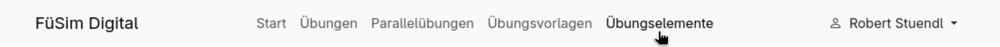

Sammlungen können von [eingeloggten Benutzern](../5_users/index.md) unter dem Menupunkt [<kbd>Übungselemente</kbd>](https://fuesim.digital/collections) verwaltet werden.
Dort befinden sich alle Sammlungen, auf die ein Benutzer Zugriff hat, einschließlich der öffentlichen Sammlungen, die von den Entwicklern bereitgestellt werden.

Um Übungselemente zu verwalten, muss zuerst eine Sammlung ausgewählt werden, in der sie gespeichert werden sollen.
Dazu kann eine Sammlung über das Klicken auf die entsprechende Kachel geöffnet werden. Mit entsprechender Berechtigung ist die Bearbeitung der Inhalte sofort möglich.
Über den Button <kbd>Neue Sammlung erstellen</kbd> kann zudem eine neue Sammlung angelegt werden, wobei ein Name und die Organisation, der die Sammlung zugeordnet werden soll, angegeben werden müssen.

## In Sammlungen verwaltete Übungselemente

Sammlungen enthalten verschiedene Typen von Übungselementen (z.B. Fahrzeuge, Personal, Material), wobei der Inhalt der Sammlung nach Typ sortiert ist.
Für jeden Typ gibt es eine eigene Überschrift und einen Button, um neue Elemente zu <kbd>erstellen</kbd>.
Bereits bestehende Übungselemente können per Klick auf die Kachel angesehen und bei Vorliegen der entsprechenden Berechtigung bearbeitet werden.

### Personal

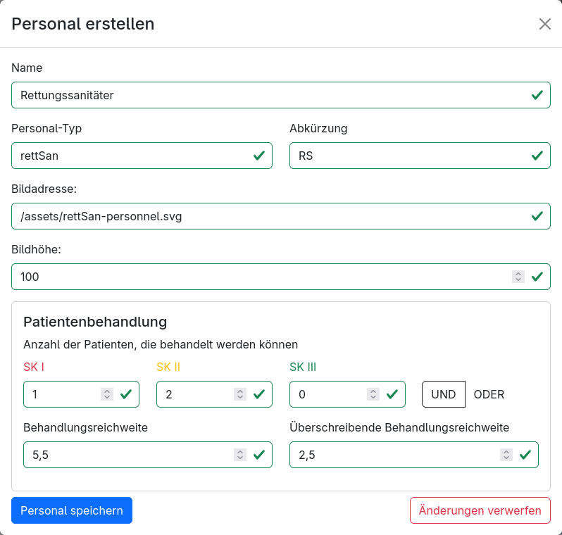

- <kbd>**Name**</kbd>: Name des Personals, welcher in der Verwaltung (z.B. Fahrzeuge, welche dieses Personal enthalten) und der Statistik angezeigt wird.
- <kbd>**Personal-Typ**</kbd>: Bezeichnung des Personaltyps
- <kbd>**Abkürzung**</kbd>: Abkürzung des Personaltyps
- <kbd>**Bildadresse**</kbd>: URL zu einer Bilddatei. Das Bild sollte idealerweise eine Vektorgrafik (`.svg`) mit transparentem Hintergrund sein.
- <kbd>**Höhe**</kbd>: Höhe des Bildes in Punkten, wobei 100 ca. der Höhe eines normalen Sprinter-RTWs entspricht. Die Breite wird analog skaliert.
- **Patientenbehandlung**
    - <kbd>**SKI**</kbd>: Anzahl an SK-I-Patienten, welche das Material behandeln kann. Bei der Einstellung **UND** können diese Kapazitätsplätze auch für weniger stark verletzte Patienten (SK II und SK III) verwendet werden.
    - <kbd>**SKII**</kbd>: Anzahl an zusätzlichen SK-II-Patienten, welche das Material behandeln kann. Bei der Einstellung **UND** können diese Kapazitätsplätze auch für SK-III-Patienten verwendet werden.
    - <kbd>**SKIII**</kbd>: Anzahl an zusätzlichen SK-III-Patienten, welche das Material behandeln kann.
    - <kbd>**UND|ODER**</kbd>: Bei **UND** sind die Kapazitäten kumulativ: Kapazitätsplätze für schwerer verletzte Patienten können auch für weniger stark verletzte Patienten verwendet werden. Bei **ODER** kann das Material nur Patienten einer einzigen Kategorie (SK I, SK II oder SK III) gleichzeitig behandeln; die Kapazitäten der anderen Kategorien werden dabei nicht kombiniert.
    - <kbd>**Behandlungsreichweite**</kbd>: Nur Patienten innerhalb dieser Reichweite können von dem Material behandelt werden. Eine Standardreichweite beträgt ca. `5,5`; die Reichweite darf `15` nicht überschreiten.
    - <kbd>**Überschreibende Behandlungsreichweite**</kbd>: Patienten innerhalb dieser Reichweite werden vom Material **bevorzugt** behandelt, auch wenn diese weniger stark verletzt sind.

### Material

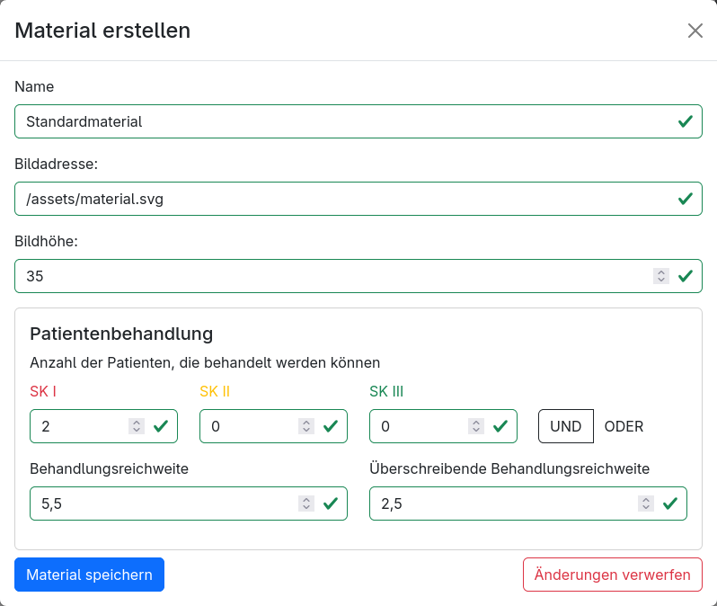

- <kbd>**Name**</kbd>: Name des Materials, welcher in der Verwaltung (z.B. Fahrzeuge, welche dieses Material enthalten) und der Statistik angezeigt wird.
- <kbd>**Bildadresse**</kbd>: URL zu einer Bilddatei. Das Bild sollte idealerweise eine Vektorgrafik (`.svg`) mit transparentem Hintergrund sein.
- <kbd>**Höhe**</kbd>: Höhe des Bildes in Punkten, wobei 100 ca. der Höhe eines normalen Sprinter-RTWs entspricht. Die Breite wird analog skaliert.
- **Patientenbehandlung**: Siehe [Personal](#personal) für die Beschreibung der Behandlungskapazitäten.

### Fahrzeuge

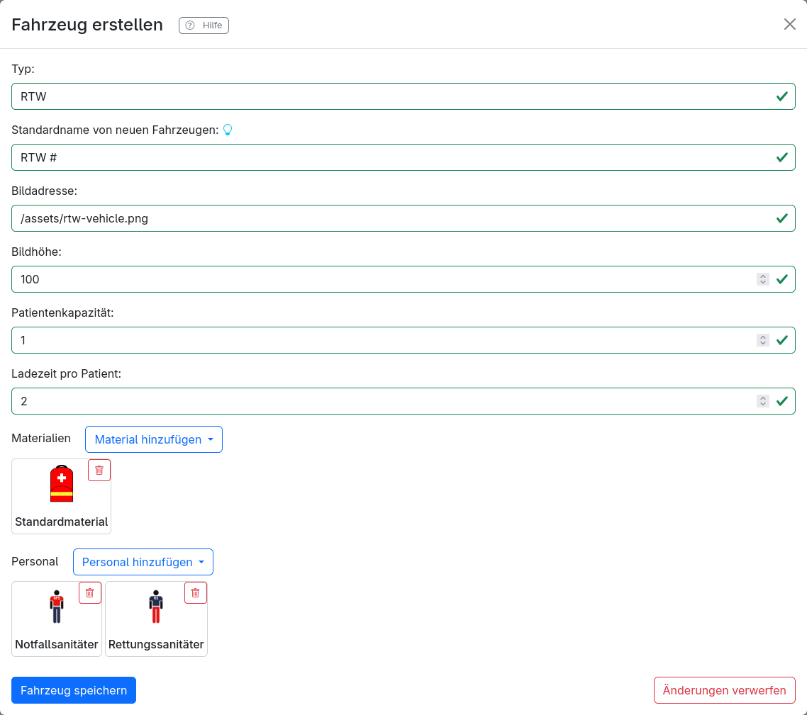

Übungsleitende können im Editor Fahrzeugvorlagen neu erstellen und bestehende Vorlagen bearbeiten. Im entsprechenden Bearbeitungsfenster kann Folgendes angegeben werden:

- <kbd>**Standardname**</kbd>: Individueller Name, mit dem neu platzierte Fahrzeuge initial versehen werden. Fahrzeuge, die ein "#" im Namen haben, werden automatisch fortlaufend innerhalb des gleichen Fahrzeug-Typs nummeriert.
- <kbd>**Typ**</kbd>: Bezeichnung des Fahrzeugtyps ohne Platzhalter für die genaue Kennung; wird im Editor angezeigt und für die Sortierung der Fahrzeuge in der Statistik verwendet.
- <kbd>**Bildadresse**</kbd>: URL zu einer Bilddatei. Das Bild sollte idealerweise eine Vektorgrafik (`.svg`) mit transparentem Hintergrund sein.
- <kbd>**Bildhöhe**</kbd>: Höhe des Bildes in Punkten, wobei 100 ca. der Höhe eines normalen Sprinter-RTWs entspricht. Die Breite wird analog skaliert.
- <kbd>**Patientenkapazität**</kbd>: Anzahl der Patienten, die im Fahrzeug transportiert werden können. Kann 0 sein für Fahrzeuge, die keine Patienten transportieren können (z.B. Führungsfahrzeuge).
- <kbd>**Ladezeit pro Patient**</kbd>: Wie lange es dauert, einen Patienten in dieses Fahrzeug zu laden. Ist eine Zeit größer 0 eingestellt, kann immer nur ein Patient gleichzeitig eingeladen werden und während der Ladezeit kann das Fahrzeug nicht bewegt werden (inklusive Transfers und Fahrt zum Krankenhaus). Um Ladezeiten für diesen Typ Fahrzeug zu deaktivieren, kann hier 0 eingetragen werden. Alternativ können Ladezeiten [in den Einstellungen](./../2_exercises/1_general.md#fahrzeuge) für die gesamte Übung deaktiviert werden.
- <kbd>**Materialien**</kbd>: Hier können Materialien hinzugefügt oder entfernt werden.
- <kbd>**Personal**</kbd>: Hier kann Personal hinzugefügt oder entfernt werden. _Es steht das Personal der aktuellen Sammlung sowie weiteren verwendeten Sammlungen zur Verfügung_

### Alarmgruppen

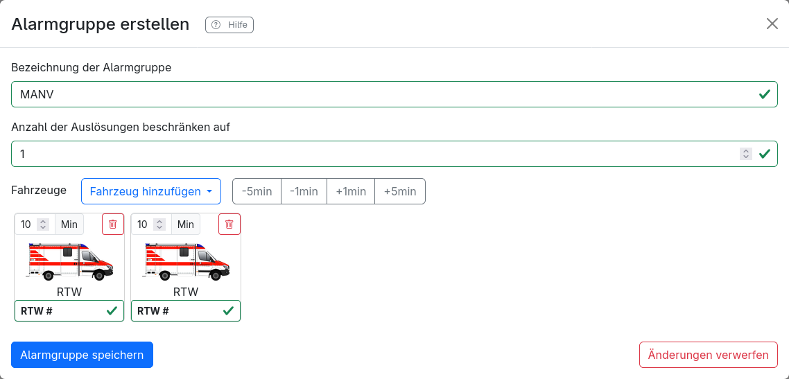

- <kbd>**Name**</kbd>: Individueller Name, mit dem neu platzierte Fahrzeuge initial versehen werden. Fahrzeuge, die ein "#" im Namen haben, werden automatisch fortlaufend innerhalb des gleichen Fahrzeug-Typs nummeriert.
- <kbd>**Anzahl der Auslösungen beschränken auf**</kbd>: Hier kann Personal hinzugefügt oder entfernt werden. Standardmäßig stehen die medizinischen Qualifikationsstufen _Sanitäter_ (ehrenamtliche Sanitätshelfer ohne rettungsdienstliche Qualifikation), _Rettungssanitäter_, _Notfallsanitäter_, _Notarzt_ und _Gruppenführer_ (hat keine Behandlungskapazität) zur Verfügung.
- <kbd>**Fahrzeuge**</kbd>: Hier können die Fahrzeuge hinzugefügt oder entfernt werden, die bei der Alarmierung dieser Alarmgruppe auf die Karte gesetzt werden sollen. _Es steht die Fahrzeuge der aktuellen Sammlung sowie weiteren verwendeten Sammlungen zur Verfügung_

### Kartenbilder

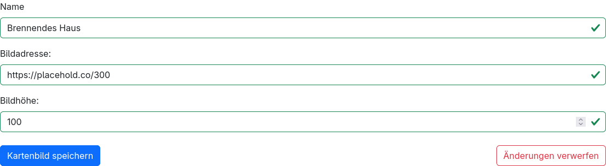

- <kbd>**Bildadresse**</kbd>: URL zu einer Bilddatei. Das Bild sollte idealerweise eine Vektorgrafik (`.svg`) mit transparentem Hintergrund sein.
- <kbd>**Name**</kbd>: Bezeichnung des Bildes, die in der Liste im Editor angezeigt wird.
- <kbd>**Höhe**</kbd>: Höhe des Bildes in Punkten, wobei 100 ca. der Höhe eines normalen Sprinter-RTWs entspricht. Die Breite wird analog skaliert.

## Weitere Sammlungen verwenden

Um eine aktuelle Sammlung um weitere Elemente aus anderen Sammlungen zu erweitern, ohne diese direkt duplizieren zu müssen, können weitere Sammlungen in der aktuellen Sammlung über den Tab <kbd>Verwendete Sammlungen</kbd> verwendet werden.

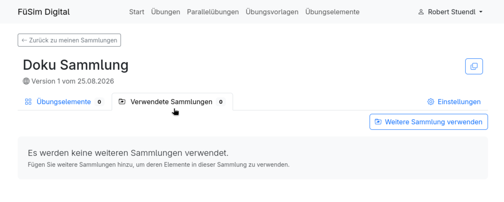

Dort befindet eine Übersicht aller Sammlungen, sowie deren Elemente, die in der aktuellen Sammlung verwendet werden.
Um eine weitere Sammlung zu verwenden, kann diese über den Button <kbd>Weitere Sammlung verwenden</kbd> hinzugefügt werden.

### Verwendete Sammlungen aktualisieren

Um in einer neuen Version einer verwendeten Sammlung hinzugekommene Elemente auch in der aktuellen Sammlung zu übernehmen, kann die verwendete Sammlung über den Button <kbd>Version aktualisieren</kbd> aktualisiert werden.

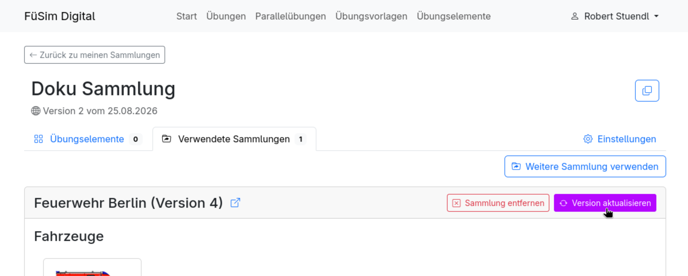

### Verwendete Sammlungen entfernen

Um eine verwendete Sammlung aus der aktuellen Sammlung zu entfernen, kann diese über den <kbd>Sammlung entfernen</kbd> Knopf entfernt werden.
Verwendete Elemente aus der entfernten Sammlung werden dann nicht mehr in der aktuellen Sammlung angezeigt und können nicht mehr in der Sammlung sowie Übungen verwendet werden.
Bereits verwendete Elemente aus der Sammlung werden dabei aus den Elementen der aktuellen Sammlung entfernt, jedoch nicht aus den Übungen, in denen diese Elemente bereits verwendet wurden.

## Versionen einer Sammlung speichern

### Neue Versionen speichern

Nach dem Erstellen, Bearbeiten oder Löschen von Übungselementen befindet sich die Sammlung in der Entwurfsphase.
Eine lilafarbene Hinweisbox weist dabei auf "unveröffentlichten Änderungen" hin.
In dieser Phase können noch beliebig viele weitere Übungselemente erstellt, bearbeitet oder gelöscht werden, ohne dass die Änderungen in Übungen wirksam werden.

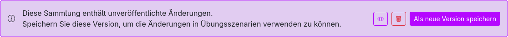

Erst durch den Klick auf <kbd>Als neue Version speichern</kbd> werden die Änderungen der Sammlung verbindlich angenommen und können in Übungen verwendet werden.
Zusätzlich zum Annehmen gibt es zwei weitere Buttons:

- <kbd> <svg xmlns="http://www.w3.org/2000/svg" width="16" height="16" fill="currentColor" class="bi bi-eye" viewBox="0 0 16 16"> <path d="M16 8s-3-5.5-8-5.5S0 8 0 8s3 5.5 8 5.5S16 8 16 8M1.173 8a13 13 0 0 1 1.66-2.043C4.12 4.668 5.88 3.5 8 3.5s3.879 1.168 5.168 2.457A13 13 0 0 1 14.828 8q-.086.13-.195.288c-.335.48-.83 1.12-1.465 1.755C11.879 11.332 10.119 12.5 8 12.5s-3.879-1.168-5.168-2.457A13 13 0 0 1 1.172 8z"/> <path d="M8 5.5a2.5 2.5 0 1 0 0 5 2.5 2.5 0 0 0 0-5M4.5 8a3.5 3.5 0 1 1 7 0 3.5 3.5 0 0 1-7 0"/> </svg> </kbd>: Über diesen Knopf können alle Änderungen an der Sammlung, welche seit der letzten veröffentlichten Version angewendet wurden, angesehen werden.
- <kbd><svg xmlns="http://www.w3.org/2000/svg" width="16" height="16" fill="currentColor" class="bi bi-trash" viewBox="0 0 16 16"> <path d="M5.5 5.5A.5.5 0 0 1 6 6v6a.5.5 0 0 1-1 0V6a.5.5 0 0 1 .5-.5m2.5 0a.5.5 0 0 1 .5.5v6a.5.5 0 0 1-1 0V6a.5.5 0 0 1 .5-.5m3 .5a.5.5 0 0 0-1 0v6a.5.5 0 0 0 1 0z"/> <path d="M14.5 3a1 1 0 0 1-1 1H13v9a2 2 0 0 1-2 2H5a2 2 0 0 1-2-2V4h-.5a1 1 0 0 1-1-1V2a1 1 0 0 1 1-1H6a1 1 0 0 1 1-1h2a1 1 0 0 1 1 1h3.5a1 1 0 0 1 1 1zM4.118 4 4 4.059V13a1 1 0 0 0 1 1h6a1 1 0 0 0 1-1V4.059L11.882 4zM2.5 3h11V2h-11z"/> </svg></kbd>: Über diesen Knopf können alle Änderungen an der Sammlung, welche seit der letzten veröffentlichten Version angewendet wurden, verworfen werden.

### Änderungen in Übungen übernehmen

Sobald eine neue Version einer Sammlung gespeichert wurde kann diese in den Übungen übernommen werden.
Dazu wird in den Übungen unter <kbd>Übungselemente verwalten</kbd> die Sammlung farbig hervorgehoben.

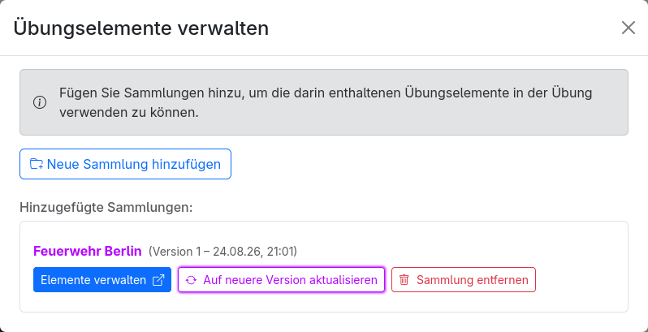

Hier muss <kbd>Auf neue Version aktualisieren</kbd> ausgewählt werden, um die Änderungen in der Übung zu übernehmen.
Dazu werden die Änderungen in der Sammlung angezeigt und es muss mit <kbd>Änderungen annehmen und Sammlung aktualisieren</kbd> bestätigt werden, dass diese Änderungen übernommen werden sollen.

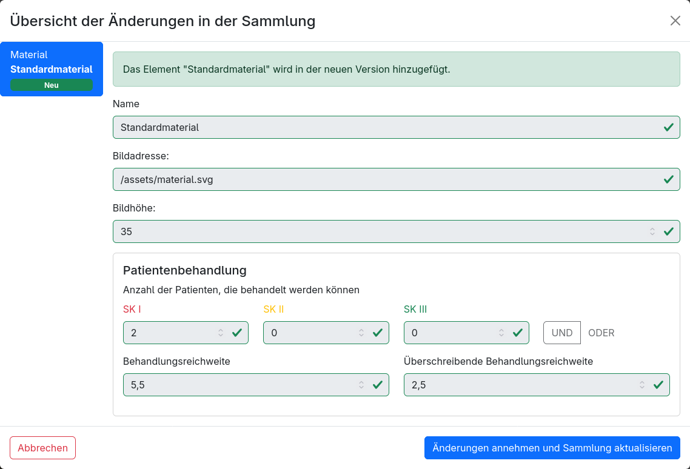

## Sammlungseinstellungen verwaltungen

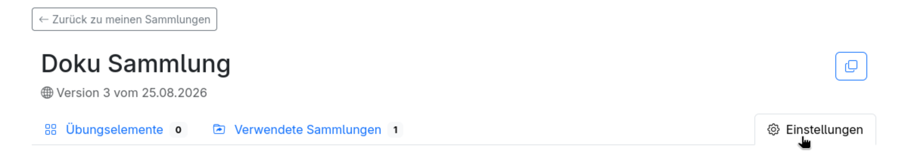

In den Sammlungseinstellungen können der Name der Sammlung sowie die zugehörige Organisationen (Mitglieder) geändert werden.

### Mitglieder verwalten

#### Hinzufügen von Mitgliedern

Einer Sammlung können weitere Organisationen hinzugefügt werden, welche somit Zugriff auf die Sammlung erhalten.
Neu hinzugefügte Organisationen können die Sammlung nur ansehen und verwenden, jedoch nicht bearbeiten oder neue Versionen veröffentlichen.

Wenn der Benutzer Zugriff auf die Organisation hat, kann der Knopf <kbd>Organisation hinzufügen</kbd> verwendet werden, um eine Organisation direkt als Mitglied der Sammlung hinzuzufügen.

Wenn der Benutzer keinen Zugriff auf die Organisation hat, kann über den Knopf <kbd>Einladungscode erstellen</kbd> verwendet werden, um einen Einladungscode zu erstellen, welcher an die Organisation weitergegeben werden kann.
Dieser Einladungscode kann auf der Übungselemente-Startseite unter <kbd>Sammlung beitreten</kbd> eingegeben werden, um eine beliebige Organisation als Mitglied der Sammlung hinzuzufügen.

> [!WARNING]
> Mit dem Einladungscode kann ein Benutzer jede beliebige Organisation als Mitglied der Sammlung hinzufügen, auf die er Zugriff hat.
> Daher sollte der Einladungscode nur an vertrauenswürdige Personen weitergegeben werden.

#### Berechtigungen von Mitgliedern

Es kann jeweils pro Sammlung nur eine Organisation als Besitzer der Sammlung festgelegt werden, welche die Sammlung bearbeiten und neue Versionen veröffentlichen kann.
Weitere Organisationen können als Mitglieder hinzugefügt werden, welche die Sammlung nur ansehen und verwenden können.

Eine andere Organsation kann durch den Knopf <kbd>Als Besitzer festlegen</kbd> als Besitzer der Sammlung festgelegt werden.
Dadurch verliert die bisherige Besitzerorganisation die Berechtigung, die Sammlung zu bearbeiten und neue Versionen zu veröffentlichen.
